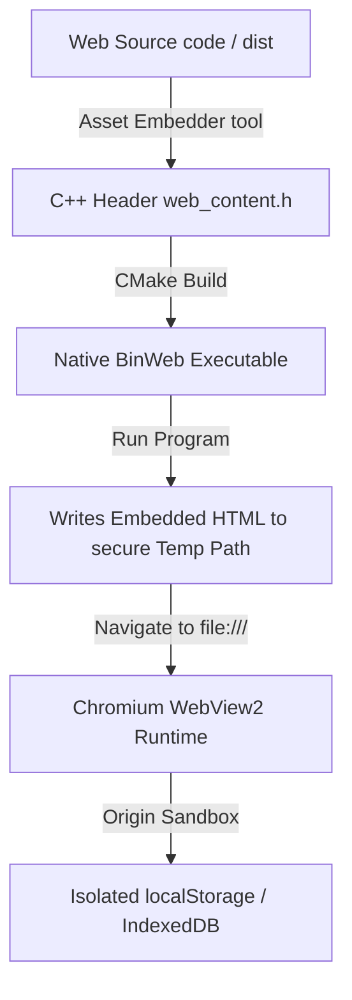

# BinWeb

BinWeb is an ultra-lightweight, zero-dependency C++ wrapper that compiles any static HTML/CSS/JS application into a standalone, single-executable Windows application powered by modern Chromium (Edge WebView2). Ditch the Electron bloat and run your web apps natively under 3MB.

---

## Why BinWeb?

Traditional methods of packaging web applications as desktop executables (like Electron) bundle an entire Node.js runtime and Chromium browser instance, resulting in massive file sizes (100MB+), high memory overhead, and complicated deployment flows.

BinWeb solves this by:
* **Zero Dependency:** Compiles to a lightweight, single native Windows binary (typically under 3MB).
* **Native Runtime:** Reuses the system's pre-installed Edge WebView2 runtime (Chromium engine), drastically reducing memory and CPU footprints.
* **Embedded Assets:** Compiles your web files directly into the C++ executable's code segment as an array of hexadecimal bytes. No external asset folder shipping required.
* **Full HTML5 Capabilities:** By utilizing isolated local filesystem rendering, BinWeb supports standard browser storage features such as `localStorage`, `IndexedDB`, WebSQL, and the Cache API out-of-the-box.

---

## Architecture Overview



### Storage Isolation
When loading HTML directly via raw data-URIs, WebViews assign a `null` origin, which blocks critical modern HTML5 APIs like `localStorage` and `IndexedDB`. BinWeb elegantly bypasses this by safely writing the embedded hex bytes to a sandboxed temporary file at startup and loading it via the `file://` protocol. This provides a valid origin, granting your web app full storage persistence natively on the host system.

---

## Handling Modern Web Frameworks (Next.js, Vite, React, Vue)

By default, the asset embedder packs a single-entry self-contained `index.html`. If you use modern bundlers that typically output segmented files (like `/assets/index-abc123.js` and `/assets/index-xyz456.css`), you have two primary options:

### Option A: Monolithic HTML Bundling (Highly Recommended)
Configure your bundler to compile all JavaScript, CSS, and media assets inline within the monolithic `index.html` file. This creates an incredibly portable single-file distribution that compiles flawlessly with BinWeb.

#### Vite Setup
Install `vite-plugin-singlefile`:
```bash
npm install vite-plugin-singlefile --save-dev
```
Update your `vite.config.js`:
```javascript
import { defineConfig } from "vite"
import react from "@vitejs/plugin-react"
import { viteSingleFile } from "vite-plugin-singlefile"

export default defineConfig({
  plugins: [react(), viteSingleFile()],
})
```

#### Next.js Setup
For static site exports (`next export`), configure Next.js to disable chunking or use a post-processor like `html-inline-assets-webpack-plugin` to output a unified standalone index file in your `/out` directory.

### Option B: Multi-Asset Directory Extraction (Roadmap)
For massive multi-page sites, see our Roadmap for directory mapping. You can configure the C++ runtime to recursively unpack your `/dist` directory assets alongside the temp HTML, or map custom virtual schemas direct from the executable code segment.

---

## 🎯 Global Single Source of Truth

Unlike other cross-platform web wrappers that force you to replicate, copy, or maintain duplicate web assets inside native build folders, **BinWeb is built around a unified Single Source of Truth.** 

All targeted platforms compile directly from the root `/web` folder:

* **🖥️ Windows C++ target:** The custom CMake pre-build `embedder` reads [web/index.html](web/index.html) and packages its hex-bytes compiled directly into the C++ executable's code segment.
* **📱 Android Kotlin target:** The Android Gradle build pipeline is configured to dynamically map the root `/web` folder as the APK assets directory at compilation time. 

Write your web application once in `/web`—compile it natively for any target seamlessly.

---

## Compilation & Installation

BinWeb supports high-performance native compilation workflows for both **Windows Desktop (C++)** and **Android Mobile (Kotlin WebView)**.

### 💻 Windows Desktop Compilation

#### Prerequisites
* **Windows 10/11**
* **Visual Studio 2022** (with *Desktop Development with C++* checked)
* **CMake** (v3.10 or higher)

#### Windows Build Pipeline

1. **Configure the Project:**
   Create a build directory and generate build files using CMake:
   ```powershell
   mkdir build
   cd build
   cmake ..
   ```

2. **Compile the Binaries:**
   Run the MSBuild compiler under the Release configuration:
   ```powershell
   cmake --build . --config Release
   ```

Upon completion, the custom `embedder` will execute automatically to convert your `/web/index.html` file, rewrite `core/web_content.h`, compile the main program, and place the executable inside:
```
build/bin/Release/BinWeb.exe
```

---

### 📱 Android Mobile Compilation (Kotlin)

The `platform/android` directory contains a pre-configured Android Studio Gradle project utilizing a modern **Kotlin** codebase. It wraps a high-speed, hardware-accelerated WebView container with persistence capabilities enabled by default.


#### Prerequisites
* **Android Studio** (Hedgehog or higher recommended)
* **Android SDK** (API Level 34 target, backward compatible to API Level 21)

#### Android Build Pipeline

1. **Configure Your Code:**
   Place your static HTML/CSS/JS web files inside the root `/web` directory. *(Ensure your main entry point file is named `index.html`).*

2. **Compile in Android Studio:**
   * Open **Android Studio** and choose **Open an Existing Project**.
   * Navigate to and select the `platform/android` folder.
   * Allow Android Studio to automatically perform a **Gradle Sync** and fetch dependencies.
   * Go to **Build -> Build Bundle(s) / APK(s) -> Build APK(s)**.

Android Studio will read the web files directly from the root `/web` directory and compile a fully functioning, self-contained standalone `.apk` executable that you can sideload or publish straight to the Google Play Store!

---

## 🔒 Security & Developer Options

It is important to understand how BinWeb handles sandboxing, source code isolation, and threat modeling:

1. **Disabled DevTools:** By default, in native builds, developer tools (F12) are completely deactivated, and the "Inspect Element" options are removed. Users cannot dynamically browse the DOM, debug Javascript, or inspect runtime elements.
2. **Right-Click Context Menu:** Standard native right-click features (like Copy, Paste, and Text Selection) are preserved, giving the program a familiar, responsive native application feel.
3. **Reverse Engineering & Memory Sandboxing:** While assets are compiled into the binary, they exist as hexadecimal bytes. This is not cryptographic encryption. Anyone with basic reverse-engineering tools (like `strings`) can extract plain-text HTML/CSS/JS segments from the compiled binary.
4. **Decryption at Runtime Bottleneck:** 
   > [!IMPORTANT]
   > Even if the assets are encrypted using symmetric encryption (like AES or XOR ciphers) during embedding, they must be decrypted in system memory to be loaded by WebView2. Furthermore, loading via the file protocol writes a temporary decrypted file to disk. To secure proprietary frontend code, **always run your JavaScript through standard production obfuscators (like *Terser* or *JavaScript Obfuscator*)** before compilation.

---

## 🗺️ Roadmap & Ecosystem

BinWeb is designed to stay microscopic, high-speed, and accessible. We welcome developers to contribute features, suggest integrations, or fork the project.

### Upcoming Milestones
* [ ] **Recursive Asset Packaging:** Enhance the pre-build tool to compress, pack, and map full directory trees (images, static resources, fonts) instead of just single files.
* [ ] **In-Memory Streaming (Custom Schemes):** Implement Win32 COM schemas (`SetVirtualHostNameToFolderMapping`) to load sandboxed assets entirely from runtime memory, eliminating temporary file writes entirely.
* [ ] **Bi-directional Bridge API:** Set up simple, high-speed C++ messaging callbacks so Javascript can execute native system functions (file IO, process execution) safely.
* [ ] **Cross-Platform Compilation:** Introduce modular build configs for WebKitGTK (Linux) and Cocoa/WKWebView (macOS) binaries.

---

## 🤝 Contributing

We love open source. If you want to contribute:
1. **Fork** the repository and create your branch.
2. Commit clear, well-commented modifications.
3. Open a **Pull Request** explaining your enhancements.

Let's make native desktop packaging fast, lightweight, and elegant again!

---

## 📄 License

This project is open-source and licensed under the permissive **MIT License** - see the [LICENSE](LICENSE) file for the full legal text and details. You are free to use, modify, and distribute it for both commercial and personal ventures.

---

## 💖 Show Your Support

BinWeb is built and maintained with absolute dedication to provide developers with a lightweight, secure, and modern desktop wrapper. 

If this project made your deployment flow easier, please consider:
* **Starring this repository** ⭐️ to help other developers discover it!
* **Sharing your feedback** or custom implementations via Issues.
* **Contributing** to our [roadmap milestones](#️-roadmap--ecosystem) to advance BinWeb further.

*Built with ♥ by [Yuvi](https://github.com/Yuvi) and the open-source community.*

