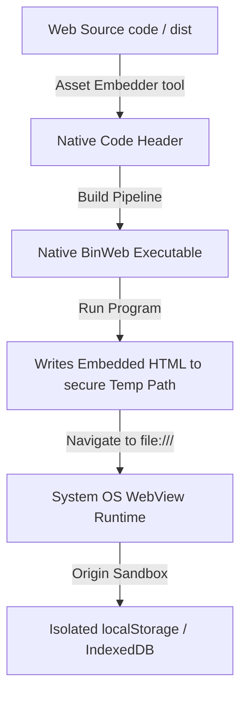

# BinWeb

BinWeb is an ultra-lightweight, zero-dependency wrapper that compiles static HTML/CSS/JS applications into standalone executables. It does this by leveraging the host OS's native WebView rather than bundling a standalone browser. Ditch the Electron bloat and run your web apps natively with a footprint typically under 3MB.

While out-of-the-box build configurations are currently provided for Windows and Android, the core architecture is inherently cross-platform and works seamlessly on macOS, iOS, and Linux using their respective native WebViews.

## Why BinWeb?

Traditional methods of packaging web applications as desktop executables bundle an entire Node.js runtime and Chromium browser instance. This results in massive file sizes, high memory overhead, and complicated deployment.

BinWeb solves this by:

* **Zero Dependency:** Compiles to a lightweight, single native binary.
* **Native Runtime:** Reuses the system's pre-installed WebView engine (Edge WebView2 on Windows, WKWebView on macOS/iOS, WebKitGTK on Linux, or Android WebView). This drastically reduces memory and CPU usage.
* **Embedded Assets:** Compiles your web files directly into the executable's code segment as an array of hexadecimal bytes. No external asset folders need to be shipped.
* **Full HTML5 Capabilities:** By utilizing isolated local filesystem rendering, BinWeb supports standard browser storage features like `localStorage`, `IndexedDB`, WebSQL, and the Cache API out-of-the-box.

## Architecture Overview



### Storage Isolation

When loading HTML directly via raw data-URIs, WebViews assign a `null` origin, which blocks critical modern HTML5 APIs like `localStorage` and `IndexedDB`. BinWeb bypasses this by writing the embedded hex bytes to a sandboxed temporary file at startup and loading it via the `file://` protocol. This provides a valid origin, granting your web app full storage persistence natively on the host system.

## Handling Modern Web Frameworks (Next.js, Vite, React, Vue)

By default, the asset embedder packs a single-entry self-contained `index.html`. If you use modern bundlers that output segmented files, you have two primary options:

### Option A: Monolithic HTML Bundling (Highly Recommended)

Configure your bundler to compile all JavaScript, CSS, and media assets inline within the monolithic `index.html` file. This creates a highly portable single-file distribution.

**Vite Setup**
Install `vite-plugin-singlefile`:

```bash
npm install vite-plugin-singlefile --save-dev

```

Update your `vite.config.js`:

```javascript
import { defineConfig } from "vite"
import react from "@vitejs/plugin-react"
import { viteSingleFile } from "vite-plugin-singlefile"

export default defineConfig({
  plugins: [react(), viteSingleFile()],
})

```

**Next.js Setup**
For static site exports (`next export`), configure Next.js to disable chunking or use a post-processor like `html-inline-assets-webpack-plugin` to output a unified standalone index file in your `/out` directory.

### Option B: Multi-Asset Directory Extraction (Roadmap)

For massive multi-page sites, you can configure the native runtime to recursively unpack your `/dist` directory assets alongside the temp HTML, or map custom virtual schemas direct from the executable code segment.

## Global Single Source of Truth

Unlike other cross-platform web wrappers that force you to replicate or maintain duplicate web assets inside native build folders, BinWeb is built around a unified single source of truth.

All targeted platforms compile directly from the root `/web` folder:

* **Windows Target:** The custom CMake pre-build embedder reads `web/index.html` and packages its hex-bytes directly into the C++ executable's code segment.
* **Android Target:** The Gradle build pipeline dynamically maps the root `/web` folder as the APK assets directory at compilation time.

Write your web application once in `/web` and compile it natively for any target.

## Compilation & Installation

BinWeb currently includes ready-to-use compilation pipelines for Windows Desktop and Android Mobile. The architecture supports macOS, iOS, and Linux, and build tooling for those platforms is planned.

### Windows Desktop Compilation (C++)

**Prerequisites**

* Windows 10/11
* Visual Studio 2022 (with Desktop Development with C++ checked)
* CMake (v3.10 or higher)

**Build Pipeline**

1. Create a build directory and generate build files using CMake:
```powershell
mkdir build
cd build
cmake ..

```


2. Compile the Binaries under the Release configuration:
```powershell
cmake --build . --config Release

```


The custom embedder will execute automatically to convert your `/web/index.html` file, compile the main program, and place the executable inside `build/bin/Release/BinWeb.exe`.

### Android Mobile Compilation (Kotlin)

The `platform/android` directory contains a pre-configured Android Studio Gradle project using Kotlin.

**Prerequisites**

* Android Studio (Hedgehog or higher recommended)
* Android SDK (API Level 34 target, backward compatible to API 21)

**Build Pipeline**

1. Place your static HTML/CSS/JS web files inside the root `/web` directory (ensure your entry point is `index.html`).
2. Open Android Studio and open the `platform/android` folder.
3. Allow Gradle to sync.
4. Go to Build > Build Bundle(s) / APK(s) > Build APK(s).

## Security & Developer Options

It is critical to understand how BinWeb handles sandboxing and threat modeling:

1. **Disabled DevTools:** By default, native builds completely deactivate developer tools (F12) and "Inspect Element" options. Users cannot dynamically browse the DOM or debug JavaScript.
2. **Native Feel:** Standard native context menu features (Copy, Paste, Text Selection) are preserved.
3. **Reverse Engineering:** Assets are compiled into the binary as hexadecimal bytes, not cryptographically encrypted. Anyone with basic reverse-engineering tools can extract plain-text HTML/CSS/JS from the compiled binary.
4. **Decryption Bottleneck:** Even if assets are encrypted during embedding, they must be decrypted in system memory to be loaded by the WebView. To secure proprietary frontend code, you must run your JavaScript through standard production obfuscators (like Terser or JavaScript Obfuscator) before compiling with BinWeb.

## Roadmap & Ecosystem

BinWeb is designed to stay microscopic and high-speed. Contributions are welcome.

**Upcoming Milestones:**

* **Official Apple/Linux Build Pipelines:** Introduce modular build configs for WebKitGTK (Linux) and Cocoa/WKWebView (macOS/iOS) to provide out-of-the-box compilation parity with Windows and Android.
* **Recursive Asset Packaging:** Enhance the pre-build tool to compress, pack, and map full directory trees instead of just single files.
* **In-Memory Streaming:** Implement native schemas to load sandboxed assets entirely from runtime memory, eliminating temporary file writes entirely.
* **Bi-directional Bridge API:** Set up a native messaging bridge so JavaScript can execute basic host system functions (file IO, process execution) safely.

## Contributing

We love open source. If you want to contribute:
1. Fork the repository and create your branch.
2. Commit clear, well-commented modifications.
3. Open a Pull Request explaining your enhancements.

## License

This project is licensed under the **MIT License**. see the [LICENSE](LICENSE) file for details. You are free to use, modify, and distribute it for both commercial and personal ventures.

---

BinWeb is built and maintained with absolute dedication to provide developers with a lightweight, secure, and modern desktop wrapper. 
